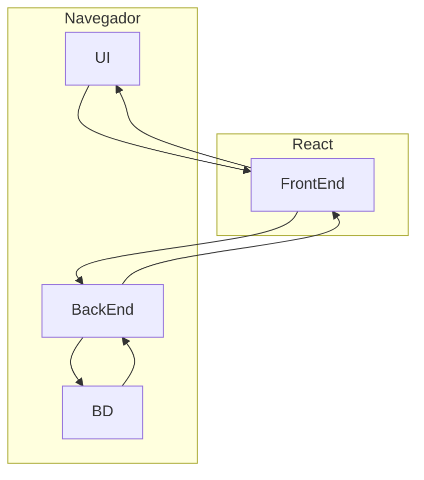

## CRIANDO DIAGRAMA COM MERMAID

### Diagrama de Fluxo de Arquitetura de Projeto

```mermaid
graph TD
    subgraph Cliente["Navegador"]
        UI
    end
    subgraph Front["React"]
        FrontEnd
    end
    subgraph Cliente["API"]
        BackEnd
    end
    subgraph Cliente["MongoDB"]
        BD
    end

    %% fluxo

    UI-->FrontEnd
    FrontEnd-->BackEnd
    BackEnd-->BD
    BD-->BackEnd
    BackEnd-->FrontEnd
    FrontEnd-->UI

```